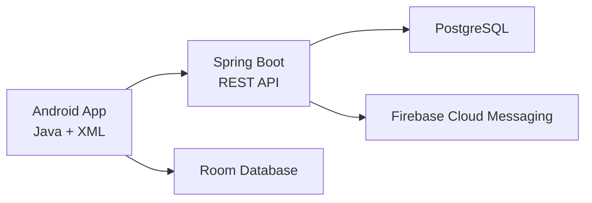

# Awtad | أوتاد

A gamified Android application that helps two friends stay consistent with their shared daily spiritual routine.

> **Project status:** Product foundation and backend infrastructure are implemented. Android client and domain features have not started yet.
## About Awtad

Awtad transforms daily spiritual routines into a cooperative journey.

Instead of showing progress as a traditional checklist, the main experience presents two characters walking on parallel paths. Each completed task moves a character forward. When both companions complete their required daily tasks, they preserve their shared streak and complete the day together.

The application is Arabic-first, privacy-aware, and designed to encourage consistency without guilt-based messaging.

## Core Experience

- Shared daily routine for two companions.
- Required and optional tasks.
- Two-character progress journey.
- Personal streak and companion streak.
- XP, coins, rewards, and streak freezes.
- Companion progress without exposing exact completed tasks.
- Local and remote notifications.
- Offline progress and reliable synchronization.
- Arabic RTL interface.

## Product Principles

- Cooperative rather than aggressively competitive.
- Encouraging rather than judgmental.
- Honest representation of missed and frozen days.
- Private by default.
- Secure and server-authoritative.
- Designed for short, consistent daily use.

## Planned Architecture



The Android application communicates with the Spring Boot API and never connects directly to PostgreSQL.

## Planned Technology Stack

### Android

- Java
- XML Views
- Material Components
- MVVM
- ViewModel and LiveData
- Navigation Component
- Retrofit and OkHttp
- Room
- WorkManager
- Firebase Cloud Messaging
- Hilt
- Lottie

### Backend

- Java 21
- Spring Boot 4.1
- Maven
- Spring Web
- Spring Data JPA
- Spring Security
- JWT authentication
- PostgreSQL
- Flyway
- OpenAPI
- Firebase Admin SDK
- JUnit, Mockito, and Testcontainers

### Tools and Infrastructure

- Android Studio
- IntelliJ IDEA
- DataGrip
- Postman
- Figma
- Git and GitHub
- Docker Compose
- GitHub Actions

## Repository Structure

```text
awtad/
├── android-app/       Native Android application
├── backend/           Spring Boot REST API
├── docs/              Product and architecture documentation
├── infra/             Local and deployment infrastructure
├── .github/workflows/ Continuous integration
├── .gitignore
└── README.md
```

Directories will be added progressively as implementation begins.

## Current Progress

| Area | Status |
|---|---|
| Product vision | In progress |
| Product requirements | Drafted |
| System architecture | Drafted |
| Development roadmap | Drafted |
| Backend | Not started |
| Android application | Not started |
| UI/UX design | Not started |
| Deployment | Not started |

## Documentation

- [Product Requirements](docs/product-requirements.md)
- [System Architecture](docs/architecture.md)
- [Development Roadmap](docs/roadmap.md)

## Initial Release Scope

The first functional release will include:

- Registration and login.
- Companion invitation and pairing.
- One shared daily routine.
- Required and optional tasks.
- Daily task completion and undo.
- Two-character journey progress.
- Personal and companion streaks.
- XP and coins.
- Basic streak freeze.
- Daily history.
- Local reminders.
- Basic companion progress notifications.

## Development Workflow

- `main` remains stable.
- Each feature is developed on a focused branch.
- Every major change is reviewed through a Pull Request.
- Secrets and local configuration files are never committed.
- Tests and documentation are updated with implementation changes.

## Future Direction

Future versions may support:

- Groups with more than two users.
- Personal routines.
- Character customization.
- Seasonal journeys.
- Advanced achievements and analytics.
- A web administration dashboard.
- Additional languages.

## Author

**Haneen Qaisi**  
Computer Engineering Student