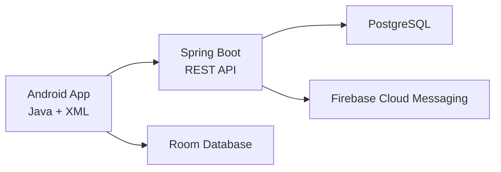
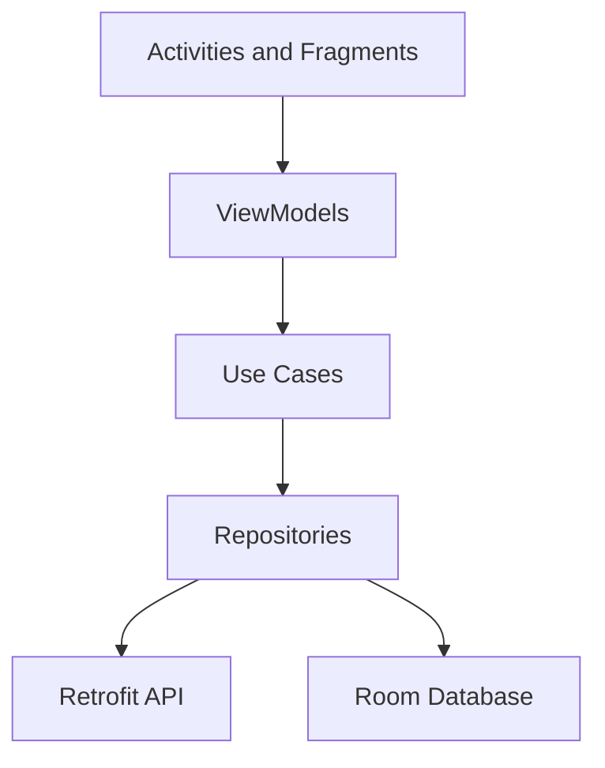

# Awtad — System Architecture

**Status:** Draft  
**Version:** 0.1

## 1. Architecture Overview

Awtad is a full-stack Android application composed of:

- A native Android application.
- A Spring Boot REST API.
- A PostgreSQL database.
- Firebase Cloud Messaging for remote notifications.
- A local Room database for offline access and synchronization.



The Android application must never connect directly to PostgreSQL.

## 2. Repository Structure

```text
awtad/
├── android-app/
├── backend/
├── docs/
├── infra/
├── .github/
│   └── workflows/
├── .gitignore
└── README.md
```

## 3. Technology Stack

### Android

- Java
- XML Views
- Material Components
- Single Activity with Fragments
- MVVM
- ViewModel and LiveData
- Navigation Component
- Repository Pattern
- Retrofit and OkHttp
- Gson
- Room
- WorkManager
- Firebase Cloud Messaging
- Hilt
- Lottie
- Glide
- JUnit
- Espresso

### Backend

- Java 21
- Spring Boot 4.1
- Maven
- Spring Web
- Spring Data JPA
- Spring Security
- JWT authentication
- Bean Validation
- PostgreSQL
- Flyway
- Spring Boot Actuator
- OpenAPI/Swagger
- Firebase Admin SDK
- JUnit
- Mockito
- Testcontainers

### Development and Infrastructure

- Git and GitHub
- IntelliJ IDEA
- Android Studio
- DataGrip
- Postman
- Figma
- Docker Compose
- GitHub Actions

## 4. Android Configuration

Initial Android configuration:

- Application ID: `com.haneenqaisi.awtad`
- Minimum SDK: API 26
- Compile SDK: API 37
- Target SDK: API 37
- UI language: Arabic
- Layout direction: RTL
- Build system: Gradle

API 26 provides broad device compatibility while allowing the application to use modern Android APIs.

## 5. Android Architecture



### UI Layer

Responsible for:

- Rendering screen state.
- Receiving user actions.
- Displaying loading, success, empty, and error states.
- Playing character and reward animations.

The UI layer must not access Retrofit, Room, or authentication tokens directly.

### Domain Layer

Contains reusable application operations such as:

- Complete a daily task.
- Undo a completion.
- Synchronize pending progress.
- Calculate local path position.
- Retrieve companion progress.

Use cases will be added when they contain reusable or non-trivial logic.

### Data Layer

Repositories coordinate:

- Remote data from the Spring Boot API.
- Local data from Room.
- Offline synchronization.
- Mapping between network, database, and domain models.

## 6. Backend Architecture

The backend will use a modular monolith architecture.

A modular monolith keeps deployment simple while separating business features clearly. It avoids the unnecessary operational complexity of microservices.

Initial backend feature packages:

```text
com.haneenqaisi.awtad
├── auth
├── user
├── companionship
├── routine
├── progress
├── streak
├── gamification
├── notification
├── shared
└── configuration
```

Each feature may contain its own:

```text
controller/
service/
domain/
repository/
dto/
mapper/
```

Business logic must remain in services and domain components, not in controllers.

## 7. Backend Responsibilities

The backend is the authoritative source for:

- User identity and authentication.
- Companion pairing.
- Shared routine configuration.
- Daily task completion.
- XP and coin rewards.
- Personal streaks.
- Companion streaks.
- Streak freezes.
- Achievement progress.
- Companion-visible progress.
- Remote notifications.

The Android application can display optimistic progress, but final rewards and streak results come from the backend.

## 8. API Design

All endpoints will be versioned:

```text
/api/v1
```

Example resource groups:

```text
/api/v1/auth
/api/v1/users
/api/v1/companionships
/api/v1/routines
/api/v1/daily-progress
/api/v1/streaks
/api/v1/rewards
/api/v1/devices
/api/v1/notification-settings
```

The API will use:

- JSON request and response bodies.
- DTOs instead of exposing entities.
- Bean Validation.
- Consistent error responses.
- Correct HTTP status codes.
- Pagination where required.
- Idempotent completion operations.
- OpenAPI documentation.

## 9. Authentication and Security

- Passwords will be hashed using Spring Security password encoding.
- Passwords will never be stored or logged as plain text.
- Authentication will use short-lived access tokens.
- Refresh tokens will be revocable.
- Protected resources will require authentication.
- Every query must verify that the requested data belongs to the authenticated user or companion pair.
- Rate limiting may be added to authentication endpoints.
- Secrets must be loaded from environment variables.
- No credentials or production keys may be committed to GitHub.

## 10. Database

PostgreSQL is the primary backend database.

Database schema changes will be managed using Flyway migrations.

Important database rules include:

- Unique usernames or email addresses.
- One active companion relationship per user in the first release.
- One completion per user, task, and local date.
- Auditable reward transactions.
- Auditable streak-freeze usage.
- Referential integrity through foreign keys.

The database design must remain extensible for future groups.

## 11. Date and Time Handling

Time handling is critical because streaks depend on calendar days.

- Full timestamps are stored in UTC.
- Each user has an IANA timezone.
- Daily progress is associated with a local date.
- The backend calculates the authoritative daily result.
- Device time alone must not determine rewards or streaks.
- Daylight-saving and timezone changes must be handled explicitly.

## 12. Offline and Synchronization Strategy

Room acts as the local source for screens that must work offline.

When a user completes a task:

1. The action is saved locally.
2. The UI updates immediately.
3. A synchronization request is scheduled.
4. The backend validates and records the action.
5. The authoritative result replaces the optimistic local result.

Each local operation must have a unique client operation ID to prevent duplicate completion and duplicate rewards.

Failed operations remain pending and are retried using WorkManager.

## 13. Notification Architecture

### Local Notifications

Generated by the Android application for:

- Routine reminders.
- Incomplete daily goals.
- Offline reminders.

### Remote Notifications

Sent through Firebase Cloud Messaging for:

- Companion progress.
- Companion daily completion.
- Shared-streak warnings.
- Cooperative challenge updates.

Notification preferences and quiet hours must be respected.

## 14. Privacy Model

The companion progress response may include:

- Display name.
- Character and cosmetic information.
- Completed-task count.
- Total-task count.
- Path position.
- Daily-goal completion.
- Streak values.

It must not include the exact names of completed tasks.

## 15. Testing Strategy

### Backend

- Unit tests for business rules.
- Repository integration tests.
- Security tests.
- Controller tests.
- PostgreSQL integration tests using Testcontainers.

### Android

- ViewModel unit tests.
- Repository tests.
- Room database tests.
- API mapping tests.
- Navigation and UI tests.
- Offline synchronization tests.

## 16. Continuous Integration

GitHub Actions will eventually:

- Build the backend.
- Run backend tests.
- Build the Android application.
- Run Android unit tests.
- Run static analysis.
- Reject commits that contain known secrets.

## 17. Deployment Strategy

During development:

- Spring Boot runs locally.
- PostgreSQL runs locally.
- The Android emulator accesses the host using `10.0.2.2`.
- A physical device uses the laptop’s local network address.

For production:

- The backend will be deployed behind HTTPS.
- PostgreSQL will not be exposed directly to the internet.
- Production secrets will be stored outside the repository.